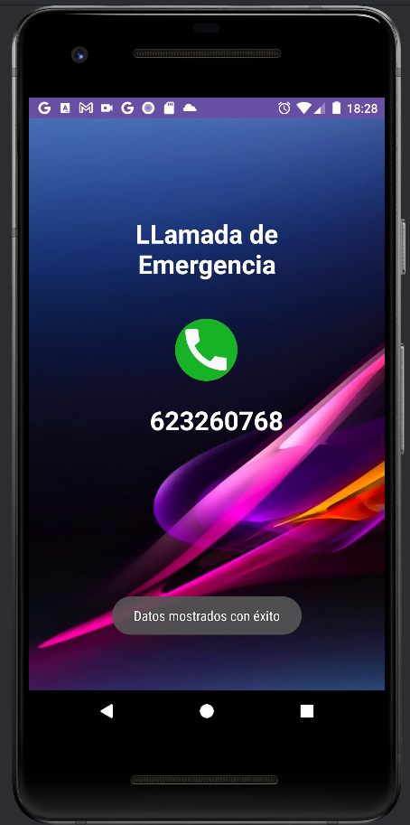

# Explicación de la APP Tema2

## Introducción

¡Bienvenidos a una experiencia única que va más allá de lanzar dados! Esta aplicación Android, 
desarrollada con pasión en Kotlin, no solo te sumerge en emocionantes partidas de dados, sino que también te ofrece un 
abanico de funcionalidades, desde un sistema de autenticación hasta servicios de entretenimiento y utilidades prácticas.


## Descripción General

Desde el emocionante juego de dados hasta la capacidad de contar chistes con sinterización de texto a voz, realizar 
llamadas, abrir URL de Google, establecer alarmas y acceder al correo electrónico, "esta app" es tu completo 
centro de entretenimiento y utilidades. La aplicación está dividida en secciones clave, incluyendo un sistema de 
autenticación robusto, un registro para nuevos usuarios y una pantalla principal repleta de funcionalidades emocionantes.


## Clase `Login`

### Descripción
Esta clase maneja la funcionalidad de inicio de sesión, validando las credenciales del usuario.

### Métodos

#### `onCreate`
- **Descripción**: Método principal llamado al crear la actividad.
- **Acciones**:
    - Infla la interfaz de usuario.
    - Inicializa eventos.
    - Carga el último usuario.

#### `initEvents`
- **Descripción**: Inicializa eventos para los botones de inicio de sesión y registro.

#### `validarCredenciales`
- **Descripción**: Válida las credenciales ingresadas por el usuario.
- **Acciones**:
    - Obtiene el nombre de usuario y contraseña.
    - Busca al usuario en la lista de usuarios.
    - Si las credenciales son válidas, inicia la actividad principal.

#### `registerUser`
- **Descripción**: Inicia la actividad de registro.

#### `getLastUsername`
- **Descripción**: Obtiene el último nombre de usuario y contraseña almacenados.
- **Retorno**: Una pareja de Strings (nombre de usuario y contraseña).

#### `guardarUltimoUsuario`
- **Descripción**: Guarda el último nombre de usuario y contraseña en las preferencias compartidas.

#### `loadLastUser`
- **Descripción**: Carga el último usuario almacenado y establece los campos de texto.

```kotlin
class Login : AppCompatActivity() {
    private lateinit var bindingLogin : ActivityLoginBinding
    override fun onCreate(savedInstanceState: Bundle?) {
        super.onCreate(savedInstanceState)
        bindingLogin = ActivityLoginBinding.inflate(layoutInflater)
        setContentView(bindingLogin.root)

        initEvents()
        loadLastUser()

    }

    private fun initEvents() {
        bindingLogin.buttonLogin.setOnClickListener {
            validarCredenciales()
        }

        bindingLogin.buttonRegistrar.setOnClickListener{
            registerUser()
        }

    }

    private fun validarCredenciales() {
        val user = bindingLogin.editTextUsername.text.toString()
        val password = bindingLogin.editTextPassword.text.toString()
        val usuarioEncontrado = Usuarios.listaUsuarios.find { it.name==user && it.password ==password }

        if (usuarioEncontrado != null) {
            // Guardar el último usuario ingresado
            guardarUltimoUsuario(user, password)
            // El usuario ha iniciado sesión con éxito
            // Credenciales válidas, iniciar Activity principal
            val intent = Intent(this, Principal::class.java)
            intent.putExtra("name", user)  // Pasa el usuario como argumento al Activity principal
            startActivity(intent)
        } else {
            // Las credenciales no son válidas
            Toast.makeText(this, "Credenciales no válidas", Toast.LENGTH_SHORT).show()
        }

    }
    private fun registerUser() {
        val  intent = Intent(this,Register::class.java)
        startActivity(intent)

    }

    private fun getLastUsername(): Pair<String,String>  {
        val preferences = getPreferences(MODE_PRIVATE)
        val lastUsername = preferences.getString("lastUsername", "") ?: ""
        val lastPassword = preferences.getString("lastPassword", "") ?: ""
        return Pair(lastUsername, lastPassword)

    }

    private fun guardarUltimoUsuario(username: String, password: String) {
        val preferences = getPreferences(MODE_PRIVATE)
        val editor = preferences.edit()
        editor.putString("lastUsername", username)
        editor.putString("lastPassword", password)
        editor.apply()
    }
    private fun loadLastUser(){
        // Recuperar el último usuario almacenado y establecerlo en el campo de texto
        val (lastUserName,lastPassword) = getLastUsername()
        bindingLogin.editTextUsername.setText(lastUserName)
        bindingLogin.editTextPassword.setText(lastPassword)
    }
}

```


## Clase `Register`

### Descripción
Maneja la funcionalidad de registro de nuevos usuarios.

### Métodos

#### `onCreate`
- **Descripción**: Método principal llamado al crear la actividad.
- **Acciones**:
    - Infla la interfaz de usuario.
    - Inicializa eventos.

#### `initEvents`
- **Descripción**: Inicializa eventos para los botones de registro y regreso al inicio de sesión.

#### `comprobarEstado`
- **Descripción**: Verifica que todos los campos estén completos y coincide la contraseña con la confirmación.
- **Acciones**:
    - Si los campos son válidos, crea un nuevo usuario y regresa al inicio de sesión.

#### `regresarLogin`
- **Descripción**: Regresa a la actividad de inicio de sesión.

```kotlin
class Register : AppCompatActivity() {
    private lateinit var bindingRegister : ActivityRegisterBinding
    override fun onCreate(savedInstanceState: Bundle?) {
        super.onCreate(savedInstanceState)
        bindingRegister = ActivityRegisterBinding.inflate(layoutInflater)
        setContentView(bindingRegister.root)

        initEvents()
    }

    private fun initEvents() {
        bindingRegister.buttonSignUp.setOnClickListener{
            comprobarEstado()
        }
        bindingRegister.buttonRegresarLogin.setOnClickListener{
            regresarLogin()
        }

    }


    private fun comprobarEstado() {
        val name = bindingRegister.editTextUsername.text.toString()
        val email = bindingRegister.editTextEmail.text.toString()
        val password = bindingRegister.editTextPassword.text.toString()
        val confirmPassword = bindingRegister.editTextTextPassword2.text.toString()
        // Verificar que ningún campo esté vacío
        if (name.isEmpty() || email.isEmpty() || password.isEmpty() || confirmPassword.isEmpty()) {
            // Mostrar un mensaje de error si algún campo está vacío
            val campo = "Campo no puede estar vacio"
            if(name.isEmpty())
                bindingRegister.editTextUsername.error = campo
            if(email.isEmpty())
                bindingRegister.editTextEmail.error = campo
            if (password.isEmpty())
                bindingRegister.editTextPassword.error = campo
            if (confirmPassword.isEmpty())
                bindingRegister.editTextTextPassword2.error = campo
            Toast.makeText(
                this, "Todos los campos deben ser completados",
                Toast.LENGTH_SHORT
            ).show()
            return
        }

        if (password == confirmPassword) {
            // Contraseña y confirmación coinciden, realiza el registro
            val usuario = Usuario(name, email, password)
            Usuarios.listaUsuarios.add(usuario)
            // Guarda la lista actualizada en el objeto Usuarios
            Usuarios.listaUsuarios = Usuarios.listaUsuarios
            Toast.makeText(
                this, "Usuario creado correctamente",
                Toast.LENGTH_SHORT
            ).show()
            val intent = Intent(this, Login::class.java)
            startActivity(intent)
        } else {
            // Contraseña y confirmación no coinciden, muestra un mensaje de error
            bindingRegister.editTextPassword.error = "Las contraseñas no coinciden"
            bindingRegister.editTextTextPassword2.error = "Las contraseñas no coinciden"
            Toast.makeText(
                this, "las contraseñas no coinciden",
                Toast.LENGTH_SHORT
            ).show()

            return
        }
    }

    private fun regresarLogin() {
        val intent = Intent(this, Login::class.java)
        startActivity(intent)
    }

}
```


## Clase `Principal`

### Descripción
Representa la pantalla principal de la aplicación.

### Métodos

#### `onCreate`
- **Descripción**: Método principal llamado al crear la actividad.
- **Acciones**:
    - Infla la interfaz de usuario.
    - Inicializa eventos.
    - Inicia la animación de entrada.

#### `initHander`
- **Descripción**: Inicia un hilo que controla la animación de entrada en la interfaz de usuario.
- **Acciones**:
    - Muestra un gif y cambia el fondo después de un tiempo de espera.

#### `login`
- **Descripción**: Obtiene el nombre de usuario de la actividad anterior y lo muestra en la interfaz de usuario.

#### `initEvent`
- **Descripción**: Inicializa eventos para los botones de llamada, entrada de datos, chistes, URL, alarma y correo electrónico.

#### `loadGif`
- **Descripción**: Muestra un gif en la interfaz de usuario.

#### `hideGif`
- **Descripción**: Oculta el gif en la interfaz de usuario.

```kotlin
class Principal : AppCompatActivity() {
    private lateinit var bindingPrincipal : ActivityPrincipalBinding
    private lateinit var txtName     : TextView
    private lateinit var intent      : Intent
    companion object{
        const val url = "https://www.google.com/"
    }
    override fun onCreate(savedInstanceState: Bundle?) {
        super.onCreate(savedInstanceState)
        bindingPrincipal = ActivityPrincipalBinding.inflate(layoutInflater)
        setContentView(bindingPrincipal.root)

        initEvent()
        initHander()
        login()
    }
    private fun initHander() {
        val handler = Handler(Looper.getMainLooper()) //queremos que el tema de la IU, la llevemos al hilo principal.
        bindingPrincipal.progressCircular.visibility = View.VISIBLE  //hacemos visible el progress
        bindingPrincipal.constraint.background = null
        loadGif()
        bindingPrincipal.layouPrincipal.visibility =   View.GONE //ocultamos el cardview.
        Thread{
            Thread.sleep( 1500)
            handler.post{
                bindingPrincipal.progressCircular.visibility = View.GONE //ocultamos el progress
                hideGif()// ocultamos el gif.
                bindingPrincipal.constraint.background = ContextCompat.getDrawable(this,
                    R.drawable.fondo_terror)
                bindingPrincipal.layouPrincipal.visibility = View.VISIBLE
                Toast.makeText(this, "Estamos en la pantalla principal",
                    Toast.LENGTH_SHORT).show()
            }
        }.start()
    }

    private fun login() {
        txtName = bindingPrincipal.txtInputLogin
        val name = getIntent().getStringExtra("name")
        if (name!= null){
            txtName.text = "$name"
        }
    }

    private fun initEvent() {
        val message = "despertar"
        val hour = 7
        val minutes = 30

        bindingPrincipal.btnCall.setOnClickListener {
            intent = Intent(this, Second::class.java).apply {
                putExtra("name", "LLamada de Emergencia")
            }
            startActivity(intent)
        }

        bindingPrincipal.btnDados.setOnClickListener{
            intent = Intent(this,EntradaDatos::class.java)
            Toast.makeText(this, "Entrada de datos", Toast.LENGTH_SHORT).show()
            startActivity(intent)
        }


        bindingPrincipal.btnChiste.setOnClickListener{
            intent = Intent(this,SintetizarTextoEnVoz::class.java)
            Toast.makeText(this, "Abrindo cuenta chistes", Toast.LENGTH_SHORT).show()
            startActivity(intent)
        }


        bindingPrincipal.btnUrl.setOnClickListener{
            intent = Intent(Intent.ACTION_VIEW).apply {
                data = Uri.parse(url)
            }
            startActivity(intent)
        }

        bindingPrincipal.btnAlarma.setOnClickListener{
            intent = Intent(AlarmClock.ACTION_SET_ALARM).apply{
                putExtra(AlarmClock.EXTRA_MESSAGE,message)
                putExtra(AlarmClock.EXTRA_HOUR,hour)
                putExtra(AlarmClock.EXTRA_MINUTES,minutes)
            }
            startActivity(intent)
        }


        val subject = "saludo"
        val content = "Hola clase PMP 23/24 "
        bindingPrincipal.btnEmail.setOnClickListener{
            intent = Intent(
                Intent.ACTION_SENDTO, Uri.fromParts("mailto","clase2Dam@educand.es",
                null)).apply {
                putExtra(Intent.EXTRA_SUBJECT,subject)
                putExtra(Intent.EXTRA_TEXT,content)
            }
            startActivity(intent)
        }

    }
    private fun loadGif(){
        val gifImageView = bindingPrincipal.imageLuces
        gifImageView.visibility = View.VISIBLE
        Glide.with(this).load(R.drawable.luces).centerCrop().into(gifImageView)
    }
    private fun hideGif(){
        bindingPrincipal.imageLuces.visibility = View.GONE
    }

}
```


# Clase `Second`

## Descripción
Esta clase gestiona la actividad de una segunda pantalla con la capacidad de realizar llamadas telefónicas.

## Métodos

### `onCreate`
- **Descripción**: Método principal llamado al crear la actividad.
- **Acciones**:
    - Infla la interfaz de usuario.
    - Inicializa eventos.
    - Muestra datos recibidos.

### `showData`
- **Descripción**: Muestra los datos en la interfaz de usuario.
- **Acciones**:
    - Obtiene el nombre pasado por la actividad anterior.
    - Muestra un mensaje de éxito.

### `initEvent`
- **Descripción**: Inicializa eventos para el botón de llamada.

### `requestPermissions`
- **Descripción**: Solicita permisos para realizar llamadas.
- **Acciones**:
    - Comprueba la versión de Android.
    - Si la versión es mayor o igual a M, solicita permisos; de lo contrario, realiza la llamada directamente.

### `call`
- **Descripción**: Realiza la llamada telefónica.

### `permissionPhone`
- **Descripción**: Verifica si se tienen permisos para realizar llamadas telefónicas.
- **Retorno**: `true` si se tienen permisos, `false` de lo contrario.

### `requestPermissionLauncher`
- **Descripción**: Lanzador de solicitudes de permisos para llamadas telefónicas.

---

```kotlin
class Second : AppCompatActivity() {
  private lateinit var bindingSecond: ActivitySecondBinding
  companion object{
    const val PHONE = "623260768"
  }
  override fun onCreate(savedInstanceState: Bundle?) {
    super.onCreate(savedInstanceState)
    bindingSecond = ActivitySecondBinding.inflate(layoutInflater)
    setContentView(bindingSecond.root)

    initEvent()
    showData()
  }

  private fun showData() {
    val txtName = bindingSecond.marcar
    val name = intent.getStringExtra("name")
    txtName.text = name
    Toast.makeText(this, "Datos mostrados con éxito", Toast.LENGTH_LONG).show()
  }

  private fun initEvent() {
    bindingSecond.btnLlamar.setOnClickListener {
      requestPermissions()
    }
  }

  private fun requestPermissions() {
    if (Build.VERSION. SDK_INT >= Build.VERSION_CODES. M){
      if (permissionPhone()){
        call()
      }
      else{
        requestPermissionLauncher.launch(Manifest.permission.CALL_PHONE)
      }
    }else{
      call()
    }
  }

  private fun call() {
    val intent = Intent(Intent. ACTION_CALL).apply {
      data = Uri.parse( "tel:$PHONE")
    }
    startActivity(intent)
  }


  private fun permissionPhone(): Boolean = ContextCompat.checkSelfPermission( this,
    Manifest.permission.CALL_PHONE) == PackageManager. PERMISSION_GRANTED


  private val requestPermissionLauncher = registerForActivityResult(
    ActivityResultContracts.
    RequestPermission()) {  isGranted ->
    if (isGranted) {
      call()
    } else {
      Toast.makeText(
        this, "Necesitas habilitar los permisos", Toast.LENGTH_LONG).show()
    }
  }
}

```


# Clase `SintetizarTextoEnVoz`

## Descripción
Maneja la síntesis de texto a voz y presenta chistes al usuario.

## Propiedades

- **`TOUCH_MAX_TIME`**: Tiempo máximo permitido entre toques para considerar una doble pulsación.
- **`touchLastTime`**: Tiempo del último toque.
- **`touchNumber`**: Número de toques (no utilizado actualmente).
- **`handler`**: Manejador para la ejecución de tareas en el hilo principal.
- **`chisteNumero`**: Número aleatorio para seleccionar un chiste.
- **`textToSpeech`**: Objeto para la síntesis de texto a voz.

## Métodos

### `onCreate`
- **Descripción**: Método principal llamado al crear la actividad.
- **Acciones**:
    - Configura la síntesis de texto a voz.
    - Inicia un hilo para el manejo de la interfaz.
    - Inicializa eventos.

### `initHander`
- **Descripción**: Inicia un hilo que controla la animación y carga de elementos en la interfaz.
- **Acciones**:
    - Muestra un gif y realiza cambios visuales después de un tiempo de espera.

### `configureTextToSpeech`
- **Descripción**: Configura la síntesis de texto a voz.

### `initEvent`
- **Descripción**: Inicializa eventos para los botones de salida y reproducción de chistes.
- **Acciones**:
    - Controla las pulsaciones para mostrar chistes y descripciones.

### `speakMeDescription`
- **Descripción**: Convierte un texto a voz y lo reproduce.

### `executorDoubleTouch`
- **Descripción**: Reproduce un chiste al detectar una doble pulsación.
- **Acciones**:
    - Muestra un mensaje y reproduce el chiste seleccionado.

### `onDestroy`
- **Descripción**: Detiene la síntesis de texto a voz al destruir la actividad.

### `hideGif`
- **Descripción**: Oculta el gif en la interfaz de usuario.

### `loadGif`
- **Descripción**: Carga un gif en la interfaz de usuario.

### `loadGif2`
- **Descripción**: Carga un segundo gif en la interfaz de usuario.

---

```kotlin
class SintetizarTextoEnVoz : AppCompatActivity() {
    private lateinit var bindingSintetizar : ActivitySintetizarTextoEnVozBinding
    private lateinit var textToSpeech: TextToSpeech  //descriptor de voz
    private val TOUCH_MAX_TIME = 500 // en milisegundos
    private var touchLastTime: Long = 0  //para saber el tiempo entre toque.
    private var touchNumber = 0   //numero de toques dado (por si acaso). De momento no nos hace falta.
    private lateinit var handler: Handler
    private  lateinit var chisteNumero : String
    val MYTAG = "LOGCAT"  //para mirar logs
    override fun onCreate(savedInstanceState: Bundle?) {
        super.onCreate(savedInstanceState)
        bindingSintetizar = ActivitySintetizarTextoEnVozBinding.inflate(layoutInflater)
        setContentView(bindingSintetizar.root)

        configureTextToSpeech()  //configuramos nuestro textToSpeech
        initHander()    //lanzaremos un hilo para el progressBar. No es necesario un hilo.
        initEvent()     //Implementación del botón.
    }

    private fun initHander() {
        handler = Handler(Looper.getMainLooper())  //queremos que el tema de la IU, la llevemos al hilo principal.
        bindingSintetizar.progressBar.visibility = View.VISIBLE  //hacemos visible el progress
        loadGif() // cargamos el gif de fondo.
        bindingSintetizar.btnExample.visibility = View.GONE  //ocultamos el botón.
        bindingSintetizar.btnSalir.visibility = View.INVISIBLE//ocultamos el boton salir
        Thread{
            Thread.sleep(3000)
            handler.post{
                bindingSintetizar.progressBar.visibility = View.GONE  //ocultamos el progress
                hideGif()// ocultamos el gif.
                loadGif2()// cargamos el gif2.
                bindingSintetizar.constraint.setBackgroundColor(ContextCompat.getColor(this,
                    R.color.claro))
                val description = getString(R.string.describe).toString()
                speakMeDescription(description)  //que nos comente de qué va esto...
                Log.i(MYTAG,"Se ejecuta correctamente el hilo")
                bindingSintetizar.btnExample.visibility = View.VISIBLE
                bindingSintetizar.btnSalir.visibility = View.VISIBLE
            }
        }.start()
    }


    private fun configureTextToSpeech() {
        textToSpeech = TextToSpeech(applicationContext, TextToSpeech.OnInitListener {
            if(it != TextToSpeech.ERROR){
                textToSpeech.language = Locale.getDefault()
                // textToSpeech.setSpeechRate(1.0f)
                Log.i(MYTAG,"Sin problemas en la configuración TextToSpeech")
            }else{
                Log.i(MYTAG,"Error en la configuración TextToSpeech")
            }
        })
    }


    private fun initEvent() {
        bindingSintetizar.btnSalir.setOnClickListener{
            Toast.makeText(this, "Regresando a la panatalla principal", Toast.LENGTH_SHORT).show()
            finish()
        }
        bindingSintetizar.btnExample.setOnClickListener{
            //Sacamos el tiempo actual
            val currentTime = System.currentTimeMillis()
            //Comprobamos si el margen entre pulsación, da lugar a una doble pulsación.
            if (currentTime - touchLastTime < TOUCH_MAX_TIME){
                //  touchNumber=0
                chisteNumero = (0..Chistes.chistes.size).random().toString()
                executorDoubleTouch(Chistes.chistes[chisteNumero.toInt()])  //hemos pulsado dos veces, por tanto lanzamos el chiste.
                Log.i(MYTAG,"Escuchamos el chiste")
            }
            else{
                //  touchNumber++
                Log.i(MYTAG,"Hemos pulsado 1 vez.")
                //Describimos el botón, 1 sóla pulsación
                speakMeDescription("Botón para escuchar un chiste")
            }
            touchLastTime = currentTime
            /*  if (touchNumber == 2) {
                  Log.i(MYTAG,"Detectamos 2 pulsaciones.")
                  touchNumber = 0
              }
  */

        }  //fin listener
    }

    //Habla
    private fun speakMeDescription(s: String) {
        Log.i(MYTAG,"Intenta hablar")
        textToSpeech.speak(s, TextToSpeech.QUEUE_FLUSH, null, null)
    }

    private fun executorDoubleTouch(chiste: String) {
        speakMeDescription(chiste)
        Toast.makeText(this,"doble pulsacion-> Chiste $chisteNumero de ${Chistes.chistes.size}",Toast.LENGTH_LONG).show()
    }

    override fun onDestroy() {
        //Si hemos inicializado la propiedad textToSpeech, es porque existe.
        if (::textToSpeech.isInitialized){
            textToSpeech.stop()
            textToSpeech.shutdown()

        }
        super.onDestroy()

    }

    private fun hideGif(){
        bindingSintetizar.imagenLuces.visibility = View.GONE
    }
    private fun loadGif(){
        val gifImageView = bindingSintetizar.imagenLuces
        gifImageView.visibility = View.VISIBLE
        Glide.with(this).load(R.drawable.luces).centerCrop().into(gifImageView)
    }

    private fun loadGif2(){
        val gifImageView = bindingSintetizar.imagenLuces
        gifImageView.visibility = View.VISIBLE
        Glide.with(this).load(R.drawable.risa).circleCrop().into(gifImageView)
    }

```
 


# EntradaDatos 

## Inicialización

La clase `EntradaDatos` extiende de `AppCompatActivity` y se encarga de gestionar la entrada de datos para el juego 
de dados. Algunas funcionalidades clave incluyen:

- **Inicialización de la IU:**
  - `onCreate` infla el diseño usando `ActivityEntradaDatosBinding`.
  - `initAdapter` configura un `ArrayAdapter` para el spinner y la vista de texto de autocompletar utilizando una lista
     de nombres de jugadores.
  - `initEvent` inicializa varios elementos de la interfaz de usuario y establece sus controladores de eventos.

## Controladores de Eventos

Se definen controladores de eventos para varios elementos de la interfaz de usuario:

- Botones, checkboxes, radio buttons, spinner, switch, y toggle button.
- Por ejemplo, `proveButtonExit` maneja el evento de clic para el botón "Salir", y `proveSwitch` maneja el evento de 
  cambio de estado para un interruptor.

## Validación

La función `comprobarEstado` valida la entrada del usuario antes de pasar a la siguiente pantalla (la pantalla de juego
de dados).

## Intención y Transición de Actividades

La función `abrirJuegoDeDados` crea una intención con datos (nombre, nivel, tiradas, nameEditAuto, edad) e inicia una 
nueva actividad (clase `Dados`) cuando se cumplen ciertas condiciones.

## Mensajes Toast

La función `showMsg` se utiliza para mostrar mensajes tipo "Toast".

## Escuchadores

Se implementan varios escuchadores utilizando expresiones lambda o clases anónimas. Por ejemplo, 
`bindingEntradaDatos.radioGroup.setOnCheckedChangeListener` y `bindingEntradaDatos.spinner.onItemSelectedListener`.

En resumen, la clase gestiona de manera efectiva la entrada de datos para un juego de dados.

```kotlin
class EntradaDatos : AppCompatActivity() {
    private lateinit var bindingEntradaDatos : ActivityEntradaDatosBinding
    private var alumns : MutableList<String> = Jugadores.namesPlayer.toMutableList()
    private lateinit var spiner: String
    private lateinit var nivel : String
    private lateinit var tiradas : String
    private lateinit var adapter : ArrayAdapter<String>

    override fun onCreate(savedInstanceState: Bundle?) {
        super.onCreate(savedInstanceState)
        bindingEntradaDatos = ActivityEntradaDatosBinding.inflate(layoutInflater)
        setContentView(bindingEntradaDatos.root)

        initEvent()
        initAdapter()
    }

    private fun initAdapter() {
        adapter = ArrayAdapter (
            this,
            com.google.android.material.R.layout.support_simple_spinner_dropdown_item,
            alumns
        )
        bindingEntradaDatos.editAuto.setAdapter(adapter)
        bindingEntradaDatos.spinner.adapter = adapter
    }


    private fun initEvent() {
        proveBtnFloat()
        proveCheck()
        proveCheck()
        proveRadio()
        proveSwitch()
        proveSpinner()
        proveToggle()
        proveButtonActionEditor()
        proveButtonExit()
    }

    private fun proveButtonActionEditor() {
        //  Anonima con lambda
        bindingEntradaDatos.editText.setOnEditorActionListener{
                v, actionId, event ->
            if (actionId == EditorInfo.IME_ACTION_SEND){
                showMsg("Clase, capturo el evento del Action del teclado")
                true
            }else
                false
        }
    }

    private fun proveRadio(){
        bindingEntradaDatos.radioGroup.setOnCheckedChangeListener{
                group, chekedId ->
            when (chekedId){
                bindingEntradaDatos.btr1.id->{
                    showMsg("1 Tirada, Seleccionada")
                    tiradas = "1"
                }

                bindingEntradaDatos.btr2.id->{
                    showMsg("2 Tiradas, Seleccionadas")
                    tiradas = "2"

                }
                bindingEntradaDatos.btr3.id->{
                    showMsg("3 Tiradas, Seleccionadas")
                    tiradas = "3"
                }
                bindingEntradaDatos.btr4.id ->{
                    showMsg("4 Tiradas, seleccionadas")
                    tiradas = "4"
                }
                bindingEntradaDatos.btr5.id ->{
                    showMsg("5Tiradas, seleccionadas")
                    tiradas = "5"
                }
            }//fin when
        }//fin función lambda
    }


    private fun proveCheck(){

        bindingEntradaDatos.chk1.setOnCheckedChangeListener{
                btnView, isCheked ->
            if (isCheked){
                showMsg("Nivel Principiante, seleccionado")
                nivel = "Nivel: Principiante"
                // Desmarcar otros CheckBox
                bindingEntradaDatos.chk2.isChecked = false
                bindingEntradaDatos.chk3.isChecked = false

            }else{
                showMsg("Nivel principiante , Deseleccionado")
            }
        }

        bindingEntradaDatos.chk2.setOnCheckedChangeListener{
                btnView, isCheked ->
            if (isCheked){
                showMsg("Nivel intermedio, seleccionado")
                nivel = "Nivel: Intermedio"
                // Desmarcar otros CheckBox
                bindingEntradaDatos.chk1.isChecked = false
                bindingEntradaDatos.chk3.isChecked = false
            }else{
                showMsg("Nivel intermedio, Deseleccionado")
            }
        }

        bindingEntradaDatos.chk3.setOnCheckedChangeListener{
                btnView, isCheked ->
            if (isCheked){
                showMsg("Nivel Experto, seleccionado")
                nivel = "Nivel: Experto"
                // Desmarcar otros CheckBox
                bindingEntradaDatos.chk1.isChecked = false
                bindingEntradaDatos.chk2.isChecked = false
            }else{
                showMsg("Nivel Experto, Deseleccionado")
            }
        }
    }

    private fun proveSwitch(){
        bindingEntradaDatos.switchBtn.setOnCheckedChangeListener {
                buttonView, isChecked ->
            if (isChecked){
                showMsg("Boton Switch activado")
            }else{
                showMsg("Boton Switch Desactivado")
            }
        }
    }


    private fun proveSpinner(){
        /*
        Con clase Abstracta y sobreescribiendo los métodos abstractos de la interfaz
        De todas formas, tengo que crear objeto de la clase Abstracta, ya que tengo que
        implementar sus métodos.
         */
        bindingEntradaDatos.spinner.onItemSelectedListener =
            object : SelectElementSpinnerAbstract(this){
                @SuppressLint("SuspiciousIndentation")
                override fun onItemSelected(
                    parent: AdapterView<*>?,
                    view: View?,
                    position: Int,
                    id: Long
                ) {
                    val select = parent?.getItemAtPosition(position).toString()
                    spiner = select

                    if (select != "Selecciona uno")
                        bindingEntradaDatos.editAuto.setText(spiner)
                        showMsg(parent?.getItemAtPosition(position).toString()+"--")
                }

                override fun onNothingSelected(parent: AdapterView<*>?) {
                    showMsg("No selecciono nada")
                }
            }
    }


    private fun proveToggle(){
        bindingEntradaDatos.toggBtn.setOnCheckedChangeListener {
                buttonView, isChecked ->
            if (isChecked){
                showMsg("Boton Toggle activado")
            }else{
                showMsg("Boton Toggle Desactivado")
            }
        }
    }


    private fun proveBtnFloat(){

        bindingEntradaDatos.btnFloat.setOnClickListener {
            showMsg(bindingEntradaDatos.editText.text.toString())
        }

       //Ejemplo de como implementar el listener con clase anónima
        val event : View.OnClickListener
        event = object : View.OnClickListener{
            override fun onClick(v: View?) {
                if (comprobarEstado()){
                    abrirJuegoDeDados()
                    showMsg("Juego de los dados")
                }

            }
        }

        /*
        botón, espera a recibir un objeto event.
        Cuando lo recibas, llama implícitamente al método onClick del objeto event.
         */
        bindingEntradaDatos.btnFloat.setOnClickListener(event)

    }

    private fun showMsg(cad : String){
        Toast.makeText(this, cad, Toast.LENGTH_LONG).show()
    }

    private fun abrirJuegoDeDados() {
        val intent = Intent(this, Dados::class.java)
        intent.putExtra("name", spiner)
        intent.putExtra("novel", nivel)
        intent.putExtra("rolls",tiradas)
        intent.putExtra("nameEditAuto",bindingEntradaDatos.editAuto.text.toString())
        intent.putExtra("age",bindingEntradaDatos.editText.text.toString())
        startActivity(intent)
    }


    private fun comprobarEstado() : Boolean{
        val edad = bindingEntradaDatos.editText .text.toString()
        val name = bindingEntradaDatos.editAuto.text.toString()
        val check1 = bindingEntradaDatos.chk1
        val check2 = bindingEntradaDatos.chk2
        val check3 = bindingEntradaDatos.chk3
        val t1 = bindingEntradaDatos.btr1
        val t2 = bindingEntradaDatos.btr2
        val t3 = bindingEntradaDatos.btr3
        val t4 = bindingEntradaDatos.btr4
        val t5 = bindingEntradaDatos.btr5
        // Verificar que ningún campo esté vacío
        if (name.isEmpty() || edad.isEmpty()){
            // Mostrar un mensaje de error si algún campo está vacío
            val campo = "Campo no puede estar vacio"
            bindingEntradaDatos.editText.error = campo
            bindingEntradaDatos.editAuto.error = campo
            Toast.makeText(
                this, "Todos los campos deben ser completados",
                Toast.LENGTH_SHORT
            ).show()
            return false
        }
        else if (!check1.isChecked && !check2.isChecked && !check3.isChecked ){
            // Mostrar un mensaje de error si algún campo está vacío
            Toast.makeText(
                this, "Elige un Nivel",
                Toast.LENGTH_SHORT
            ).show()
            return false
        }
        else if (!t1.isChecked && !t2.isChecked && !t3.isChecked && !t4.isChecked && !t5.isChecked){
            // Mostrar un mensaje de error si algún campo está vacío
            Toast.makeText(
                this, "Elige Cuantas Tiradas Quieres",
                Toast.LENGTH_SHORT
            ).show()
            return false
        }
        return true
    }

    private fun proveButtonExit(){
        bindingEntradaDatos.btnSalir.setOnClickListener{
            Toast.makeText(this, "Regresando a la panatalla principal",
                Toast.LENGTH_SHORT).show()
            finish()
        }
    }
}

```


# Clase `Dados`

## Descripción
Controla la funcionalidad de la actividad de lanzamiento de dados.

## Propiedades

- **`sum`**: Variable para almacenar la suma de los dados.

## Métodos

### `onCreate`
- **Descripción**: Método principal llamado al crear la actividad.
- **Acciones**:
    - Infla la interfaz de usuario.
    - Inicializa eventos.

### `initEvent`
- **Descripción**: Inicializa eventos para los botones de jugar y salir.

### `loadGif`
- **Descripción**: Carga un gif en la interfaz de usuario.

### `game`
- **Descripción**: Inicia el juego de lanzamiento de dados.
- **Acciones**:
    - Limpia la imagen del dado.
    - Muestra el resultado del juego.

### `sheduleRun`
- **Descripción**: Planifica la ejecución de hilos para simular el lanzamiento de dados.

```kotlin
class Dados : AppCompatActivity() {
    private lateinit var bindingDados : ActivityDadosBinding
    private var sum : Int = 0
    private lateinit var txtName     : TextView
    override fun onCreate(savedInstanceState: Bundle?) {
        super.onCreate(savedInstanceState)
        bindingDados = ActivityDadosBinding.inflate(layoutInflater)
        setContentView(bindingDados.root)


        initEvent()
    }

    private fun initEvent() {
        player()
        loadGif() // cargamos gif de fondo
        bindingDados.txtResultado.visibility = View.INVISIBLE
        bindingDados.buttonJugar.setOnClickListener{
            bindingDados.txtResultado.visibility = View.VISIBLE
            game()  //comienza el juego

        }
        bindingDados.buttonSalir.setOnClickListener{
            Toast.makeText(this, "Regresando a Configuración", Toast.LENGTH_SHORT).show()
            finish()
        }

    }

    private fun loadGif() {
        val gifImageView = findViewById<ImageView>(R.id.image_fondo)
        Glide.with(this).load(R.drawable.giphy).centerCrop().into(gifImageView)
    }

    //Comienza el juego
    private fun game(){
        bindingDados.imagviewCarta.setImageDrawable(null)
        bindingDados.txtResultado.text = "0"
        sheduleRun() //planificamos las tiradas.
    }


    private fun sheduleRun() {

        val schedulerExecutor = Executors.newSingleThreadScheduledExecutor()
        val tiradas =  bindingDados.tiradas.text.toString().toLong()
        val msc = 1000
        for (i in 1..tiradas){//lanzamos 5 veces el dado
            schedulerExecutor.schedule(
                {
                    throwDadoInTime()  //Lanzo los tres dados.
                },
                msc * i.toLong(), TimeUnit.MILLISECONDS)
        }
        schedulerExecutor.schedule({//El último hilo, es mostrar el resultado.
            viewResult()
        },

            msc  * (tiradas + 2), TimeUnit.MILLISECONDS)
        schedulerExecutor.shutdown()  //Ya no aceptamos más hilos.
    }


    /*
    Método que lanza los tres dados a partir de 3 aleatorios.
     */
    private fun throwDadoInTime() {
        val numDados = Array(3){ Random.nextInt(1, 6)}
        val imagViews : Array<ImageView> = arrayOf<ImageView>(
            bindingDados.imagviewDado1,
            bindingDados.imagviewDado2,
            bindingDados.imagviewDado3)

        sum = numDados.sum() //me quedo con la suma actual.

        for (i in 0..2) {
            imagViews[i].startAnimation(animation()) // Aplicar la animación a la ImageView.
            animarVaso()// Aplicar animacion al vaso.
            selectView(imagViews[i], numDados[i])
        }
    }


    /*
    Método que dependiendo de la vista, carga una imagen de dado u otro.
     */
    private fun selectView(imgV: ImageView, v: Int) {
        when (v){
            1 -> imgV.setImageResource(R.drawable.dado1);
            2 -> imgV.setImageResource(R.drawable.dado2);
            3 -> imgV.setImageResource(R.drawable.dado3);
            4 -> imgV.setImageResource(R.drawable.dado4);
            5 -> imgV.setImageResource(R.drawable.dado5);
            6 -> imgV.setImageResource(R.drawable.dado6);
        }
    }


    /*
    Muestra los resultados, que es la suma de la última tirada.
     */
    private fun viewResult() {
        bindingDados.txtResultado.text = sum.toString()
        println(sum)
        val imgView = bindingDados.imagviewCarta
        imgView.startAnimation(animationCard())
        selectCard(imgView,sum)


    }

    /*
     Animamos los dados en cada tirada.
     */
    private fun animation():Animation{
        val fadeIn = AlphaAnimation(0f, 1f) // Animación de fade in
        fadeIn.duration = 1000 //Duración de la animación en milisegundos
        val rotate = RotateAnimation(
            0f, 360f,//Ángulo de inicio y fin de la rotación
            //Punto central de rotación (centro horizontal)
            Animation.RELATIVE_TO_SELF, 0.5f,
            //Punto central de rotación (centro vertical)
            Animation.RELATIVE_TO_SELF, 0.5f,
        )
        rotate.duration = 800 //

        val scale = ScaleAnimation(
            0f, 1f,  // Factor de escala de inicio y fin
            0f, 1f,  // Factor de escala de inicio y fin
            Animation.RELATIVE_TO_SELF, 0.5f,//Punto central de escala (centro horizontal)
            Animation.RELATIVE_TO_SELF, 0.5f //Punto central de escala (centro vertical)
        )
        scale.duration = 100 // Duración de la animación en milisegundos


        val translate = TranslateAnimation(
            Animation.RELATIVE_TO_SELF, 0f,//Desplazamiento inicial (ninguno en el eje X)
            Animation.RELATIVE_TO_SELF, 0f,//Desplazamiento final (ninguno en el eje X)
            Animation.RELATIVE_TO_SELF, -4f,//Desplazamiento inicial (arriba en el eje Y)
            Animation.RELATIVE_TO_SELF, 0f //Desplazamiento final (ninguno en el eje Y)
        )
        translate.duration = 500 // Duración de la animación en milisegundos
        translate.interpolator = BounceInterpolator()
        translate.startOffset = 100

        // El parámetro booleano indica si las animaciones comparten el interpolador
        val animationSet = AnimationSet(true)
        animationSet.addAnimation(rotate)
        animationSet.addAnimation(fadeIn)
        animationSet.addAnimation(translate)
        animationSet.addAnimation(scale)

        return animationSet
    }

    private fun animarVaso(){
        val imgVaso = bindingDados.imageButton
        val rotar = RotateAnimation(
            0f, 180f,  // Ángulo de inicio y fin de la rotación
            //Punto central de rotación (centro horizontal)
            Animation.RELATIVE_TO_SELF, 0.50f,
            // Punto central de rotación (centro vertical)
            Animation.RELATIVE_TO_SELF, 0.50f,
        )
        rotar.duration = 600// Duración de la animación en milisegundos
        rotar.fillAfter = true
        imgVaso.startAnimation(rotar)
    }
    private fun selectCard(imgV: ImageView, v: Int){
        when (v){
            3 -> imgV.setImageResource(R.drawable.carta3);
            4 -> imgV.setImageResource(R.drawable.carta4);
            5 -> imgV.setImageResource(R.drawable.carta5);
            6 -> imgV.setImageResource(R.drawable.carta6);
            7 -> imgV.setImageResource(R.drawable.carta7);
            8 -> imgV.setImageResource(R.drawable.carta8);
            9 -> imgV.setImageResource(R.drawable.carta9);
            10 -> imgV.setImageResource(R.drawable.carta10);
            11 -> imgV.setImageResource(R.drawable.carta11);
            12 -> imgV.setImageResource(R.drawable.carta12);
            13 -> imgV.setImageResource(R.drawable.carta13);
            14 -> imgV.setImageResource(R.drawable.carta14);
            15 -> imgV.setImageResource(R.drawable.carta15);
            16 -> imgV.setImageResource(R.drawable.carta16);
            17 -> imgV.setImageResource(R.drawable.carta17);
            18 -> imgV.setImageResource(R.drawable.cartas18);
        }
    }

    private fun animationCard(): Animation{
        val translate = TranslateAnimation(
            Animation.RELATIVE_TO_SELF, 5f,//Desplazamiento inicial (ninguno en el eje X)
            Animation.RELATIVE_TO_SELF, -1f,//Desplazamiento final (ninguno en el eje X)
            Animation.RELATIVE_TO_SELF, 0f,//Desplazamiento inicial (arriba en el eje Y)
            Animation.RELATIVE_TO_SELF, 0f //Desplazamiento final (ninguno en el eje Y)
        )
        translate.duration = 1000 // Duración de la animación en milisegundos
        translate.interpolator = BounceInterpolator()
        translate.startOffset = 100

        return translate
    }

    private fun player() {
        txtName = bindingDados.txtJugador
        val txtNivel = bindingDados.textNivel
        val txtTiradas = bindingDados.tiradas
        val txtEdad = bindingDados.txtEdad
        val txtName1 = bindingDados.txtJugador
        val name = intent.getStringExtra("name")
        val novel = intent.getStringExtra("novel")
        val rolls = intent.getStringExtra("rolls")
        val age = intent.getStringExtra("age")
        val nameEditAuto = intent.getStringExtra("nameEditAuto")
        if (name!= null){
            txtName.text = "$name"
            txtNivel.text = "$novel"
            txtTiradas.text= "$rolls"
            txtEdad.text = "$age"
            

        }
        if (name == "Selecciona uno" || name != nameEditAuto){
            txtName1.text = "$nameEditAuto"
        }
    }
}


```


___

## Resumen del Código

La aplicación está estructurada en torno a varias actividades clave: autenticación, registro y 
la pantalla principal. Desde el manejo seguro de la información del usuario hasta la integración de diversas 
funcionalidades, el código se ha diseñado meticulosamente para ofrecer una experiencia fluida y versátil. 


___

[REPOSITORIO: https://github.com/johnlopez0505/actividadEvaluableTema2.git](https://github.com/johnlopez0505/actividadEvaluableTema2.git)